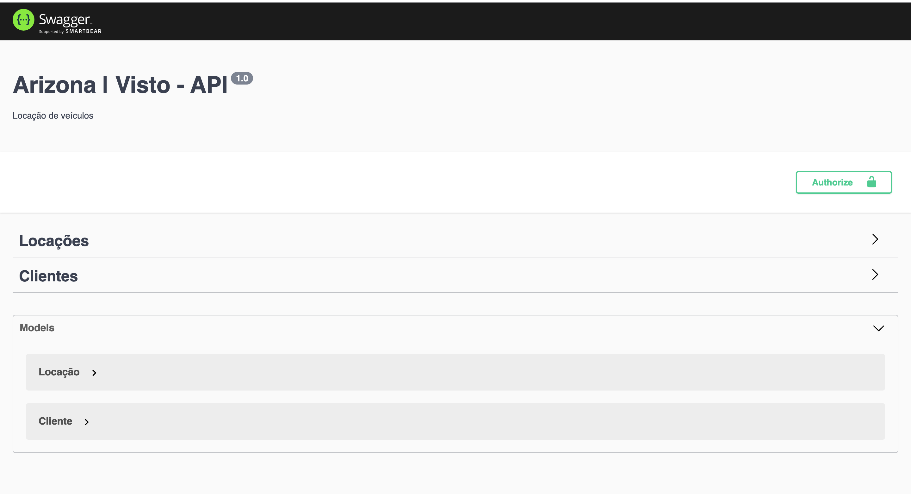

## LOCAÇÃO DE VEÍCULOS

Para instação do projeto é necessário ter instalado Docker na versão 19.03.5.
Tutorial de instalação:
[Docker](https://www.docker.com/get-started),

Após a instalacão entre na pasta do projeto e execute o comando `docker-compose up`.

## Rotas

| Endpoints                               |  Finalidade  |
| --------------------------------------- | :----------: |
| http://localhost:4000                   |   Url Base   |
| http://localhost:4000/documentation/api | Documentação |

## Sobre o Projeto

Projeto desenvolvido para processo seletivo em uma empresa sensacional `Arizona | Visto`.
Tem como objetivo, a locação de veículos com base em clientes cadastrados.
